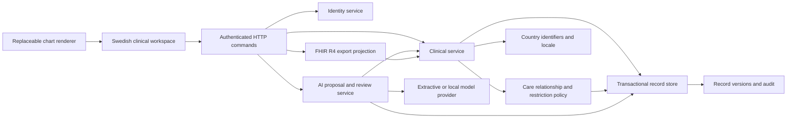

# System Overview

Primary source: [docs/ARCHITECTURE.md](../ARCHITECTURE.md),
[docs/PLUGINS.md](../PLUGINS.md), [.claude/rules/architecture.md](../../.claude/rules/architecture.md).

## What Eir is

An Apache-2.0 electronic health record, version `0.2.0`, Node ≥22.13,
TypeScript, run directly via `tsx` (no compile step in development). Backend
HTTP is Fastify 5 (`@fastify/cookie`, `@fastify/rate-limit`, `@fastify/static`).
Storage is SQLite (`node:sqlite`, i.e. Node's built-in experimental SQLite
API) or PostgreSQL (`pg`) — both implement the same `Store` contract. The
frontend (`apps/web`) is hand-written ES modules with no frontend framework
(no React/Vue/Angular) and no bundler in the loop for development; chart
rendering is itself pluggable. AI providers are an extractive (no-LLM)
default and a local Ollama adapter. Terminology is ICD-10-SE via a local
importer. See `package.json` for the exact dependency list.

## The plugin contract (runtime API v2)

```ts
{
  id: string,            // e.g. "eir.storage.postgres"
  version: string,       // semantic version, visible at /api/plugins
  apiVersion: 2,
  provides: string[],    // service keys this plugin implements
  requires: string[],    // service keys this plugin depends on
  setup(ctx): void | (() => void | Promise<void>)
}
```

`ctx.get(key)` resolves an already-instantiated required dependency.
`ctx.provide(key, impl)` registers this plugin's implementation of a service.
`ctx.onDispose(fn)` registers cleanup run in reverse order on shutdown or
setup failure. The runtime resolves the dependency graph, rejects cycles and
duplicate providers for the same key, and only exposes declared dependencies
to each plugin. `npm run plugins` prints the resolved graph without touching
the database.

The full `Services` interface (every service key a plugin can `provide` or
`require`) is defined once, in `packages/contracts.ts`:

```
coordinationDirectory, coordination, sipPlans, coordinationPayment,
coordinationDocuments, coordinationNotifications, modules, riskEngine,
deterioration, followUp, followUpPolicy, notificationTransport, integrations,
labTransport, workforce, accessReview, medications, laboratories, careTeam,
terminology, store, country, access, clinical, aiProvider, aiReview, fhir,
identity
```

Domain plugins depend on these interfaces, never on another plugin's concrete
class, and never issue SQL directly — only `plugins/storage-sqlite.ts` and
`plugins/storage-postgres.ts` touch the database.

## Composition roots

Each `apps/*.ts` entry point loads exactly one profile via
`packages/runtime.ts`'s `fromConfig` and wires a server or worker around it:

| File | Profile | Purpose |
| --- | --- | --- |
| `apps/server.ts` | `eir.config.json` (default) | Legacy local dev server, SQLite, loopback |
| `apps/staging-server.ts` | `eir.staging.config.json` | Persistent synthetic staging, PostgreSQL, loopback |
| `apps/public-server.ts` | `eir.demo.config.json` | Disposable public demo, one in-memory workspace per visitor |
| `apps/integration-worker.ts`, `apps/follow-up-worker.ts`, `apps/deterioration-worker.ts`, `apps/coordination-worker.ts` | caller-supplied via `EIR_CONFIG` | Background processing |

There is no browser endpoint that installs code or edits a profile; changing
providers is an operator action plus a restart.

## Trust model — read before any security review

Server plugins and UI bundles are reviewed, operator-installed code running
with full application privileges. Dependency declaration (`requires`/
`provides`) is a **programming** contract, not a security sandbox — an
in-process plugin can still import filesystem or network APIs directly. A
malicious or buggy storage/policy plugin can violate every guarantee this
documentation describes. Multi-vendor untrusted extensions need a separate
process/container with a restricted API principal, explicit patient scope,
and controlled egress — Eir does not provide that isolation today, and no
design should assume it does. This applies uniformly across chart renderers,
AI providers, storage providers, and every domain plugin.

## Record model and transactions

Every entity has tenant, patient ID, kind, revision, timestamps, and a
validated payload. The API accepts clinical *commands* (`save`, `sign`,
`amend`, `correct`, `close`, `complete`, …), never arbitrary JSON resource
writes. The full command plus its version/audit inserts commit or roll back
together in one transaction. Runtime API v2 uses asynchronous unit-of-work
contracts (`Store.transaction(async () => ...)`) across storage and stateful
services; see [database.md](database.md) and [../database/transactions.md](../database/transactions.md).

## Diagram (from docs/ARCHITECTURE.md)



## When to add a new plugin vs. extend an existing one

Add a new plugin/service key when the capability is genuinely independently
replaceable (a new storage backend, a new AI provider, a new lab transport).
Extend an existing plugin when the capability is a variant of something that
already exists (a new resource type in the FHIR export, a new permission in
workforce). When in doubt, match the shape of the nearest existing pair (e.g.
`plugins/risk-http.ts` next to `plugins/risk-vitals.ts` — same contract,
alternate implementation).
